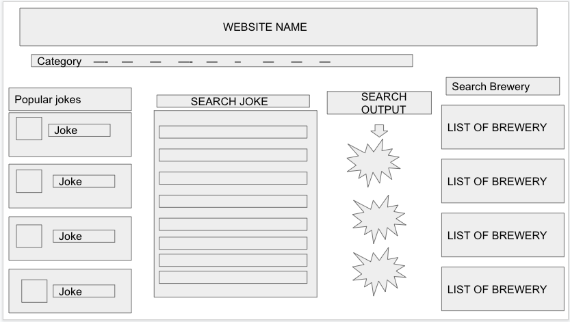
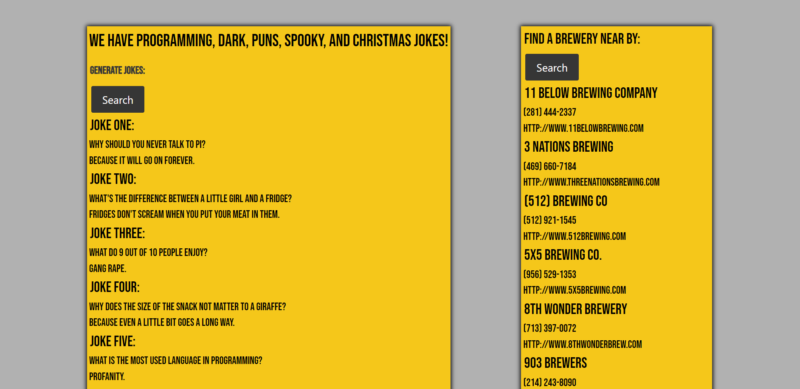
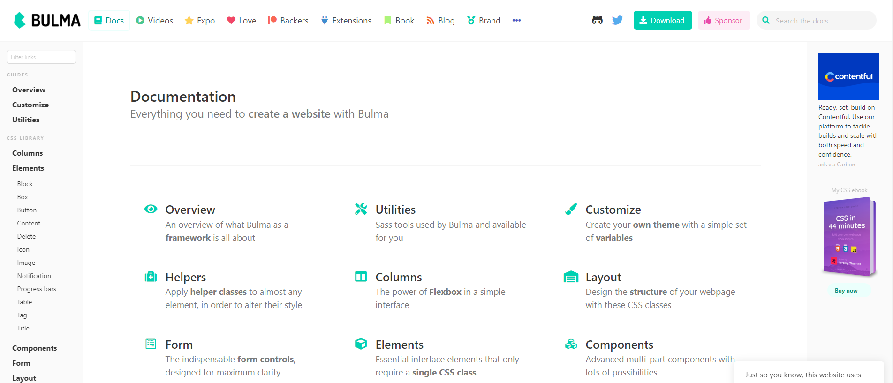
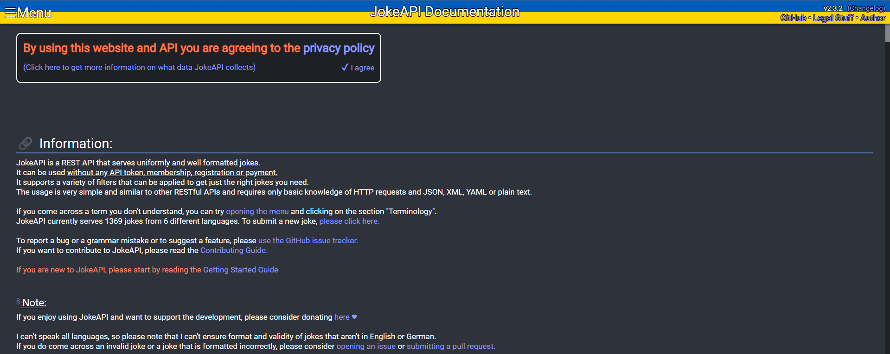
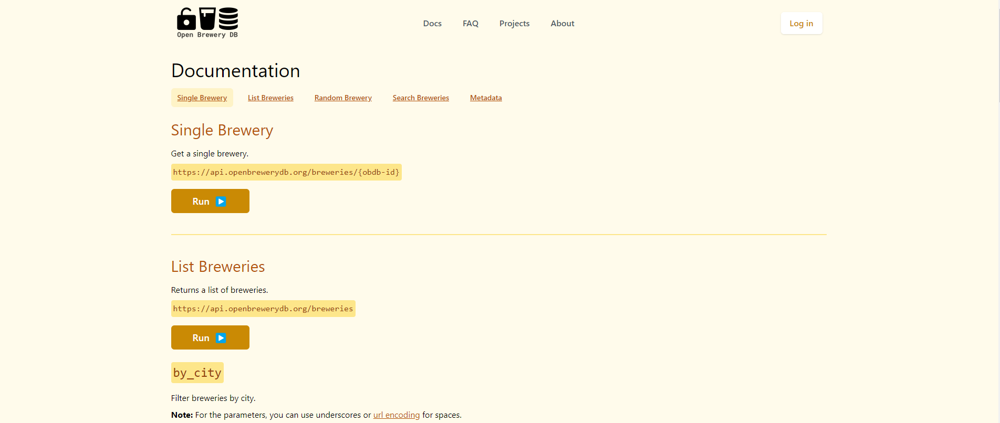

# Mugs-N-Puns

## **Description**
Mugs-N-Puns is a website designed to create jokes and find breweries. We have a list of 5 jokes that generate everytime the search button is clicked.

We also have a list of breweries within Texas that are generated when a search button is clicked.
     
To achieve this, we used two different APIs. One API gave us a number of options for different kinds of jokes. THe other API generates the name, number, and website of different breweries.

## **Table of Contents**
- [**Installation**](#installation)
- [**Wireframe**](#wireframe)
- [**Website**](#website)
- [**Technologies**](#technologies)
- [**Credits**](#credits)
- [**license**](#license)

## **Installation**
No installation required. You can visit our fully functional website here: 

## **Wireframe**
    We considered 4 different wireframes which are:

    But we ended up up choosing

## **Website**

    Our final website looks like this.

Before user input:

After user input:

## **Technologies**
    - HTML
    - CSS (Bulma)
    - JavaScript
    - JQuery
    - Third Party API's (JokeAPI, Open Brewery DB)

https://bulma.io/documentation/

https://sv443.net/jokeapi/v2/

https://www.openbrewerydb.org/documentation#single-brewery

## **Credits**
    Our collaborators include: 
        Fabien Moreno: https://github.com/fabien1313
        Christian Mendez: https://github.com/christian1512-FE
        Evan Coates: https://github.com/evanacoates
        Deborah Adane: https://github.com/dadane1

## **License**

MIT License

Copyright (c) 2022 fabien1313

Permission is hereby granted, free of charge, to any person obtaining a copy
of this software and associated documentation files (the "Software"), to deal
in the Software without restriction, including without limitation the rights
to use, copy, modify, merge, publish, distribute, sublicense, and/or sell
copies of the Software, and to permit persons to whom the Software is
furnished to do so, subject to the following conditions:

The above copyright notice and this permission notice shall be included in all
copies or substantial portions of the Software.

THE SOFTWARE IS PROVIDED "AS IS", WITHOUT WARRANTY OF ANY KIND, EXPRESS OR
IMPLIED, INCLUDING BUT NOT LIMITED TO THE WARRANTIES OF MERCHANTABILITY,
FITNESS FOR A PARTICULAR PURPOSE AND NONINFRINGEMENT. IN NO EVENT SHALL THE
AUTHORS OR COPYRIGHT HOLDERS BE LIABLE FOR ANY CLAIM, DAMAGES OR OTHER
LIABILITY, WHETHER IN AN ACTION OF CONTRACT, TORT OR OTHERWISE, ARISING FROM,
OUT OF OR IN CONNECTION WITH THE SOFTWARE OR THE USE OR OTHER DEALINGS IN THE
SOFTWARE.